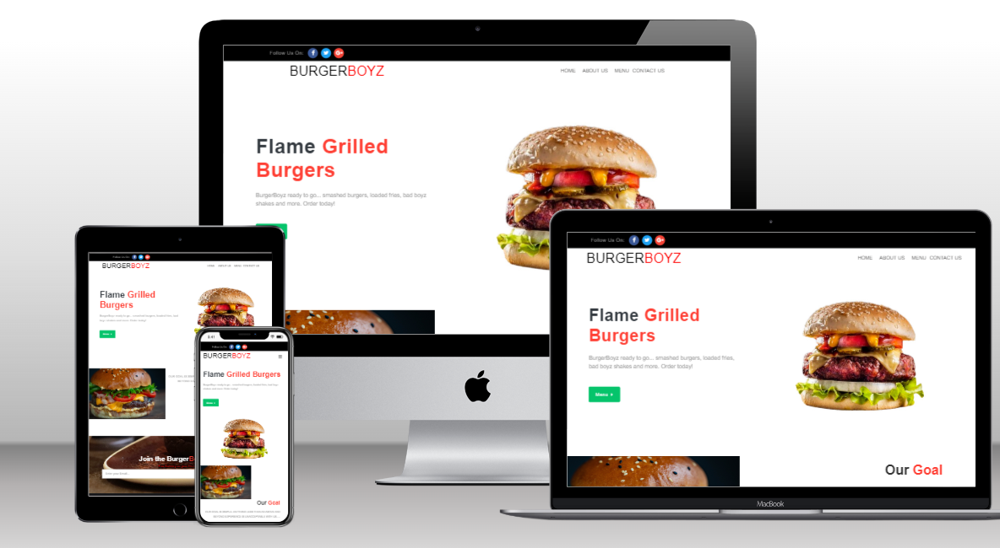

# Milestone One

### Code Institute: User-Centric Frontend Development Milestone Project


## BurgerBoyz - [Live Site](https://vchopra86.github.io/BurgerBoyz-milestone-project-one/)

## Project Overview
This project is a website for a fictional restaurant named "Burger Boyz" for submission as milestone project 1 as part of the Code Institute - Diploma in Software Development (Full stack) course.

The main aim of this project is to construct an aesthetic, easily-navigable, responsive and 
modern website which greatly helps the marketing potential of the newly opened restaurant. 
It will be constructed using HTML, CSS & Bootstrap 4 web coding methods.

The website showcases the restaurants Home Page, About Us Page, Menu Page and a Contact Us Page which allows the user to fill in a form.

The repository on Github that contains the website source code and assets is available at the following url: [Code Repository](https://github.com/VCHOPRA86/BurgerBoyz-milestone-project-one)

The website was built with a responsive look and feel for desktop, tablet and mobile devices

 - - - - 
## Contents

1. [UX](#UX "Goto UX")
    * [Website Owner Business Goals](#Website-goals "Goto Website-Goals")
    * [Wireframes](#Wireframes "Goto Wireframes")

2. [Features](#Features "Goto Features")
    * [Existing Features](#Existing-Features "Goto Existing Features")
    * [Features Left to Implement](#Features-Left-to-Implement "Goto Features Left to Implement")

3. [Technologies Used](#Technologies-Used "Goto Technologies Used")

4. [Testing](#Testing "Goto Testing")

5. [Deployment](#Deployment "Goto Deployment")
6. [Credits](#Credits "Goto Credits")
    * [Content](#Content "Goto Content")
    * [Code](#Code "Goto Code")
    * [Media](#Media "Goto Media")
    * [Acknowledgements](#Acknowledgements "Goto Acknowledgements")

 - - - -

## Website Owner Business Goals

The main goal for the business owner is to have this website 
serve as an online hub of information for prospective new customers, to engage 
new customers and provide all the necessary information such as business location, menus served, and easy to find contact methods.


### First-time Users


* "As a new user I want to easily find all the necessary information that one would expect when viewing a restaurant website."

* "As a new customer I want to see the restaurant's social presence."

* "As an event promoter I want to contact the restaurant about hosting an event there."

* "As a new/returning user I want to be able to quickly access the menu section of the site to view what particular foods are available."

* "As a new/returning customer I wish to be notified by newsletter about the latest deals, upcoming events & staying up to date with the restaurant."

* "As a new customer I want to know about upcoming events held at the restaurant."

* "As a new user I want to easily find the contact methods & opening times if they need to ask business about extra information"


### Wireframes

Wireframes were created using [Mockitt](https://mockitt.wondershare.com/) wireframe editor. Layouts were created for mobile and desktop to assist the design decisions before coding.

**Desktop**

* [Home Page](https://github.com/VCHOPRA86/BurgerBoyz-milestone-project-one/blob/main/wireframes/desktop/Home-desktop.png)
* [About Us Page](https://github.com/VCHOPRA86/BurgerBoyz-milestone-project-one/blob/main/wireframes/desktop/About%20Us-desktop.png)
* [Menu Pages](https://github.com/VCHOPRA86/BurgerBoyz-milestone-project-one/blob/main/wireframes/desktop/Menu-desktop.png)
* [Contact Page](https://github.com/VCHOPRA86/BurgerBoyz-milestone-project-one/blob/main/wireframes/desktop/Contact-desktop.png)

**Mobile**

* [Home Page](https://github.com/VCHOPRA86/BurgerBoyz-milestone-project-one/blob/main/wireframes/mobile/Mobile-Home.png)
* [About Us Page](https://github.com/VCHOPRA86/BurgerBoyz-milestone-project-one/blob/main/wireframes/mobile/Mobile-About%20Us.png)
* [Menu Pages](https://github.com/VCHOPRA86/BurgerBoyz-milestone-project-one/blob/main/wireframes/mobile/Mobile-Menu.png)
* [Contact Page](https://github.com/VCHOPRA86/BurgerBoyz-milestone-project-one/blob/main/wireframes/mobile/Mobile-Contact.png)


## Features

### Existing Features:

* **Navigation** - The navbar contains the restaurant logo and four main links Home - About Us - Menu - Contact Us.

*  **Menu List** - Three menus have been provided covering all dishes available at the restaurant - Breakfast, Lunch and Dinner. The items include a description of the dish, allergen information, dietary information and pricing.

*  **Image Popup** - Menu page has a popup feature when clicking on the menu.

*  **Newsletter Sign-Up** - Visitors can sign up to a newsletter to keep up to date with restaurant news and upcoming events.

*  **Contact Form** - Visitors can contact the restaurant via the contact page using the contact form for any further information or queries.

*  **Header/Footer** - The header & footer dislays links to the restaurants social media accounts & authors information.


 - - - - 

## Technologies Used

* [HTML5](https://en.wikipedia.org/wiki/HTML5)
  * For structuring the site pages.

* [CSS](https://en.wikipedia.org/wiki/Cascading_Style_Sheets)
  * For styling the content of each page.

* [Bootstrap 4](https://getbootstrap.com/)
  * Framework used to form the layout of each page.

* [Font Awesome](https://fontawesome.com/)
  * Used for adding social media icons and location marker icons.

* [Mockitt](https://mockitt.wondershare.com/home.html)
  * Used for adding social media icons and location marker icons.

* [Pexels](https://www.pexels.com/)
  * Pexels was used to source imagery for the website.


* [Adobe Photoshop](https://www.adobe.com/ie/products/photoshop.html)
  * For image editing and resizing.

* [Techsini](https://techsini.com/multi-mockup/)
  * Techsini was used to help check responsiveness and take screenshots of the page at different screen sizes.

* [WebFormatter](https://webformatter.com/html)
  * WebFormatter was used to help beautify the code.

* [Google Chrome Dev Tools](https://developer.chrome.com/docs/devtools/)
  * WebFormatter was used to help beautify the code.
    Google Chrome's Dev Tools were used while building the project to test responsiveness and for debugging.

 
* [Visual Studio Code](https://code.visualstudio.com/)
  * Integrated development environment (IDE) used for development.

* [GitHub](https://github.com/)
  * Used for managing and storing my code.

* [GitHub Pages](https://pages.github.com/)
  * Used to deploy the site.

 - - - - 

## Testing

Please refer here for more information on testing of the BurgerBoyz website

 - - - - 

## Deployment
Visual Studio Code IDE was used to develop the website. The code was committed to git and pushed to GitHub within Visual Studio Code.

The site is hosted on Github Pages and was deployed using the following steps:

1. Log into GitHub
2. Select correct repository from the dashboard.
3. Select "settings" on the repository page.
4. Under "GitHub Pages" section, choose master brance as source.

Live site can be viewed here: [BurgerBoyz]([https://justinmcc066.github.io/MS1/index.html](https://vchopra86.github.io/BurgerBoyz-milestone-project-one/))

### Local

1. Navigate to [(https://github.com/VCHOPRA86/BurgerBoyz-milestone-project-one.git)]
2. Click the green 'Clone or Download' button and copy the text url in the dropdown.
3. Open up a terminal window in your IDE of choice.
4. Navigate to your desired file location.
5. Paste the following code and input it into your terminal to clone.
```
git clone [https://github.com/VCHOPRA86/BurgerBoyz-milestone-project-one.git]
```

 - - - - 

## Credits

### Content
All content was written and developed by me.

### Code
The following sites were used for inspiration and assistance:

* [CSS Tricks](https://css-tricks.com/)
* [Stack Overflow](https://stackoverflow.com/)

### Media
The images used on this site are royalty free and were obtained from [Pexels](https://www.pexels.com/)

