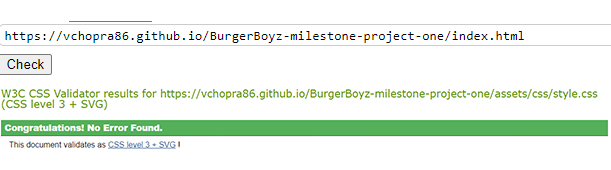
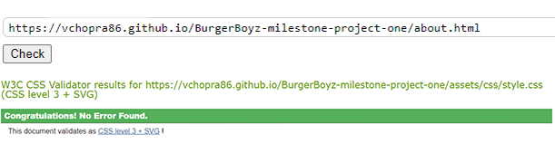
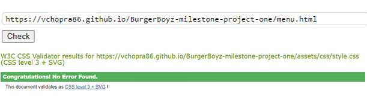
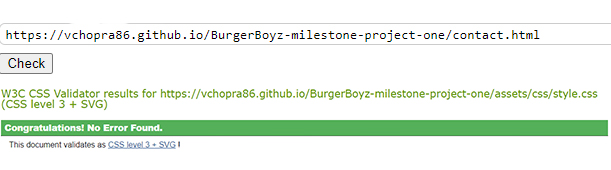
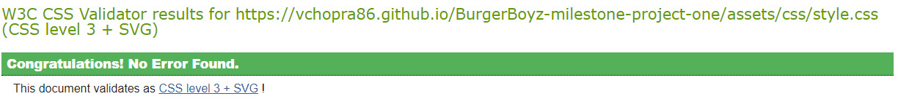

# Testing

The BurgerBoyz website has been tested using the following methods:
- [Code Validation](#code-validation)
    - [W3C HTML Validator](#w3c-html-validator) 
        - [Home Page](#home-page)
        - [Exhibitions Page](#exhibitions-page)
        - [Artists Page](#artists-page)
        - [About Page](#about-page)
        - [Contact Page](#contact-page)
    - [W3C CSS Validator](#w3c-css-validator)
- [Lighthouse](#lighthouse)
- [Responsiveness](#responsiveness)
- [A11y Color Contrast Accessibility Checker](#a11y-color-contrast-accessibility-checker)
- [Browser Compatibility](#browser-compatibility)
- [Testing User Stories](#testing-user-stories)
    - [Prospective Visitors](#prospective-visitors)
    - [Art Collectors](#art-collectors)
    - [Business Owners](#business-owners)
- [Peer Review](#peer-review)
- [Bugs](#bugs)
    - [Resolved](#resolved)
    - [Unresolved](#unresolved)

# Code Validation

## W3C HTML Validator

BurgerBoyz website has passed all tests using the W3C HTML Validator tool

### Home Page
<h2 align="center"></h2>

### About Us Page
<h2 align="center"></h2>

### Menu Page
<h2 align="center"></h2>

### Contact Us Page
<h2 align="center"></h2>

## W3C CSS Validator

BurgerBoyz website has passed all tests using the W3C CSS Validator tool
<h2 align="center"></h2>

# Browser Compatibility

The site was tested in Google Chrome, Microsoft Edge and Mozilla Firefox on desktop.

The site was tested in Google Chrome on mobile and tablet.

No issues detected during browser testing. CSS transitions worked on all browsers tested. 

Appearance, functionality and responsiveness were largely consistent across browsers and devices. Exceptions (see Resolved Bugs)

# Responsiveness

Responsivity tests were carried out using Google Chrome DevTools. Device screen sizes covered include:
- iPhone SE
- iPhone XR
- iPhone 12 Pro
- Pixel 5
- Samsung Galaxy S8+
- Samsung Galaxy S20 Ultra
- iPad Mini
- iPad Air
- Surface Pro 7
- Surface Duo
- Galaxy Fold
- Samsung Galaxy A51/71
- Nest Hub
- Nest Hub Max

I also personally tested the website on a Cubot kingkong Star, Dell XPS 13 laptop and a LG widescreen monitor.

# Project Feedback Review

In the final stages of the project, I received feedback from friends & family. 
The feedback on the website and documentation was positive overall.  Feedback included changing the color of the paragraphs from #999 to #2b2828 as some found it hard to read. Making the logo a clickable link back to the home page. Adding a'Back to Top' button visible on all screen sizes. All have been implemented

# Bugs

- Issue found on width size 360px with the Hamburger was out of alignment. Issue was fixed by changing the padding size.

- Issues found on width size 280px with the logo being to large and the newsletter info button was overflowing outside of the max width. Both issues were fixed by reducing the font size of the logo and by changing the padding to 0. 

Back to [README.md](/README.md#testing)